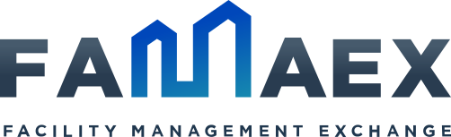

# Desarrollador Ruby on Rails

Hola developer!

Somos FAMAEX, una startup nacida hace 6 años, que ahora forma parte del grupo
[Dominion](https://www.dominion-global.com/es/), y que ha revolucionado el mundo del facility management mediante el uso
de la tecnología. Ayudamos a las empresas a encontrar los profesionales que necesitan en sus establecimientos para
resolver las incidencias que surgen en el día a día.

Estamos buscando un desarrollador Ruby on Rails para que se una a nuestro equipo de IT y nos ayude a crecer profesional
y personalmente. ¿Te gusta la idea? Sigue leyendo y te contamos un poco más sobre nosotros.

## ¿Cuál es nuestro stack?

Tenemos un backend Rails con un API JSON que es consumida tanto por nuestra aplicación frontend como por las dos
aplicaciones móviles.

* Ruby on Rails 7
* MySQL
* Sidekiq / Redis
* RSpec
* Github

Aunque ese es nuestro stack actual, nuestros objetivos para los próximos meses son:

* Migrar a PostgreSQL
* Migrar la aplicación frontend de Angular a Rails + Hotwire (Turbo & Stimulus)
* Mejorar nuestra cobertura de tests
* Terminar de migrar toda nuestra lógica de negocio a service objects.

## ¿Cómo es nuestro día a día?

* Reuniones diarias entre desarrolladores (dailys) para comentar qué hicimos ayer, con qué nos vamos a poner hoy y si
  tenemos algún impedimento que nos impida terminar el trabajo.

* Reuniones semanales (viernes) con toda la empresa para estar alineados y saber en qué está trabajando cada 
  departamento.

* Demo técnica cada dos semanas, en la que enseñamos el trabajo realizado al resto de compañeros justo antes de que se
  suba a producción.

* Uso de Google Meet y Slack para mantenernos comunicados tanto entre los desarrolladores cómo con el resto de
  compañer@s de la empresa.

## ¿Qué ofrecemos?

* Trabajar en una empresa con un solo producto, con un ritmo de trabajo adecuado para que puedas dar lo mejor de ti.

* Trabajo 100% remoto. No nos importa desde dónde trabajes siempre y cuando tengas la residencia en España y tu zona
  horaria sea similar a la nuestra, ya que así es más fácil organizar reuniones y trabajar mediante Slack.

* Encuentros anuales para fomentar la unión del equipo, que con el trabajo en remoto siempre se agradece.

* Salario bruto anual 20-30K en función de conocimientos y experiencia.

* Contrato indefinido.

* Horario flexible. Los viernes por la tarde no trabajamos ;)

* La flexibilidad de una start-up junto con la estabilidad de Dominion, un grupo con +10.000 empleados, con una
  facturación de +1.000M€/año y presente en +35 países

## ¿Qué necesitamos de ti?

* Que seas una persona proactiva, con ganas de trabajar y de aprender de forma constante. No te preocupes si hay algo
  que no dominas, aquí tendrás tiempo para aprenderlo mientras implementas el código.

* Tener mínimo un año de experiencia con Rails. No nos importa tener que explicarte cosas avanzadas, pero si que debes
  conocer lo básico del framework y la tecnología web.

* Que hayas trabajado con las diferentes tecnologías que usamos en nuestro stack o con herramientas similares.

## ¿Cómo participar en el proceso de selección?

* Escríbenos un correo a cv.it@famaex.com y mándanos tu CV.

* Si tienes perfil en github o escribes un blog de tecnología, nos encantará verlo.

